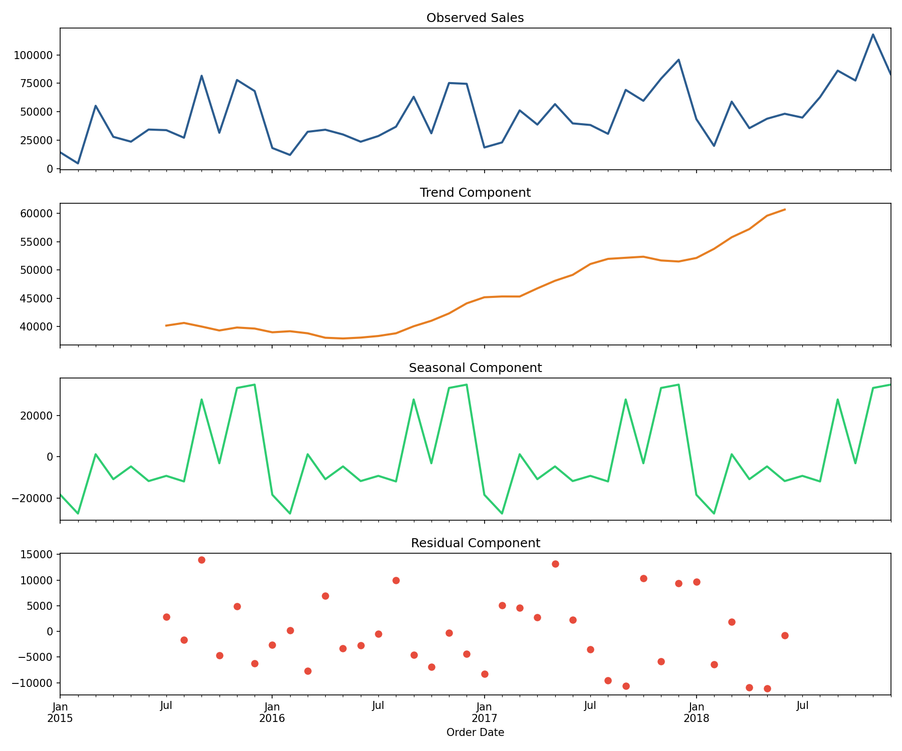
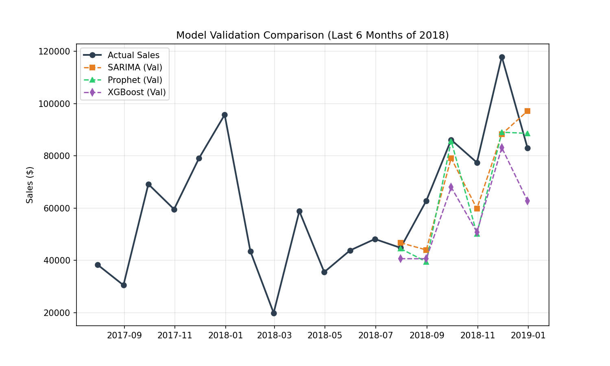
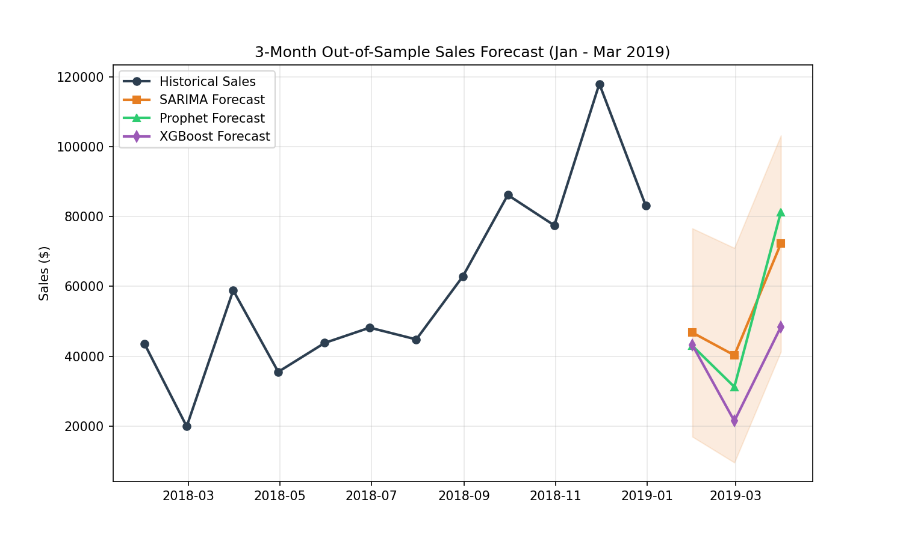
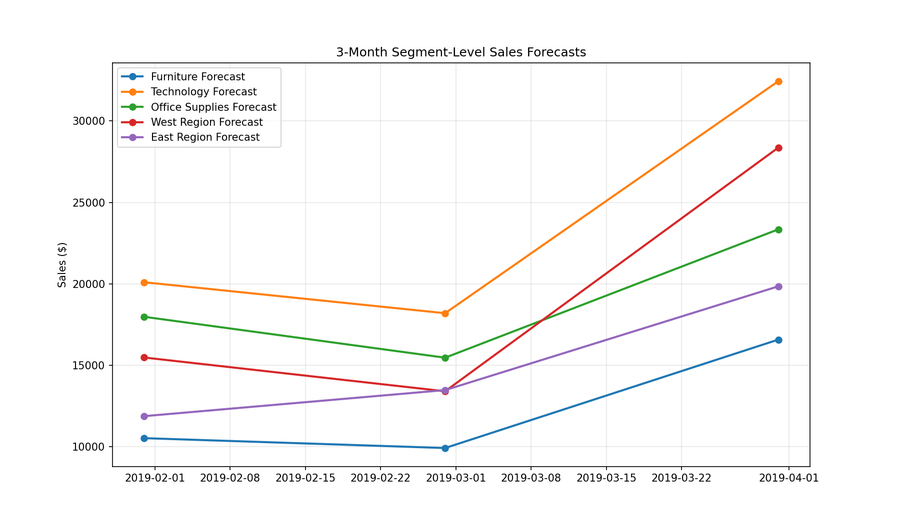
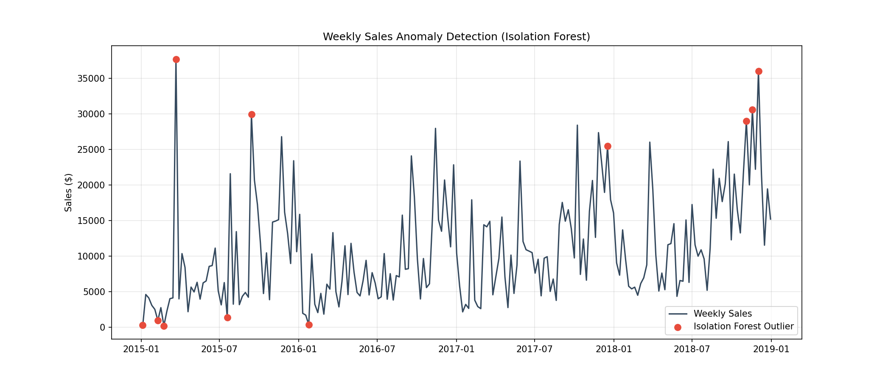
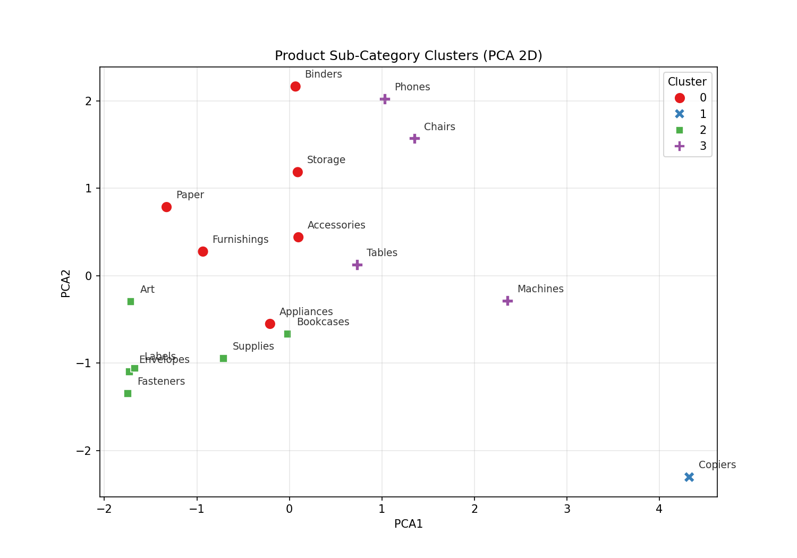

# XYlofy AI - Internship Final Project: Sales Forecasting & Demand Intelligence System

[](https://www.python.org/)
[](https://scikit-learn.org/)
[](https://facebook.github.io/prophet/)
[](https://streamlit.io/)

An end-to-end data science, machine learning, and time-series forecasting system to predict future product demand, identify sales anomalies, segment products based on customer demand patterns, and present all findings through an interactive business dashboard. This project was developed as the **Internship Final Project (Weeks 3 & 4)** at **XYlofy AI**.

---

## 🎯 Project Overview & Objectives
Every retail and e-commerce business faces the critical question: *"How much of each product will we sell next month, and will we have enough stock to meet that demand?"* Pricing and inventory inefficiencies cost crores—overstocking locks up capital and wastes storage, while understocking leads to lost sales and customer dissatisfaction. 

The objective of this project is to build an automated demand intelligence engine that:
1. **Performs deep exploratory analysis** on 4 years of daily transaction data (`train.csv`) and merges it with macro-level industry data (`vgsales.csv`).
2. **Decomposes time-series signals** to isolate underlying trends, seasonality, and residual noise.
3. **Builds and validates** three forecasting models: **SARIMA (Statistical)**, **Facebook Prophet (Industry-standard)**, and **XGBoost (ML-based)**.
4. **Conducts segment-level forecasting** for product categories and geographic regions.
5. **Detects weekly operational anomalies** using unsupervised outlier models (Isolation Forest and Z-Score).
6. **Groups products into demand categories** using K-Means clustering to recommend stocking strategies.
7. **Deploys a live interactive dashboard** using Streamlit.

---

## 📂 Repository Structure
The project is structured as follows:
```text
SalesForecasting_RishiSrivastava/
├── train.csv                # Superstore Sales dataset (9,800 records)
├── vgsales.csv              # Supplementary Video Games Sales dataset (16,598 records)
├── product_segments.csv     # Clustering output details
├── weekly_sales_anomalies.csv # Weekly anomaly data points
├── analysis.ipynb           # Fully executed Jupyter Notebook with all 8 tasks
├── app.py                   # Multi-page interactive Streamlit dashboard
├── requirements.txt         # Package dependencies for deployment
├── summary.pdf              # 2-page PDF executive business report for the CFO/C-Suite
└── charts/                  # High-resolution visual assets
    ├── decomposition.png
    ├── validation_comparison.png
    ├── forecast_comparison.png
    ├── segment_forecasts.png
    ├── anomalies_isolation_forest.png
    ├── anomalies_zscore.png
    ├── elbow_curve.png
    ├── kmeans_pca_clusters.png
    └── prophet_components.png
```

---

## 📈 Model Performance & Validation
We resampled daily transactions into monthly totals and evaluated our models on a validation set comprising the last 6 months of historical data (July - December 2018):

| Model Type | Mean Absolute Error (MAE) | Root Mean Squared Error (RMSE) | Mean Absolute Percentage Error (MAPE) |
| :--- | :---: | :---: | :---: |
| **SARIMA (1,1,1)x(1,1,1,12)** (Best Model) | **$14,862.39** | **$17,299.71** | **17.89%** |
| **Facebook Prophet** | $14,309.99 | $18,954.58 | **17.47%** |
| **XGBoost Regressor** | $20,999.65 | $22,951.30 | 25.62% |

### Key Observations
* **SARIMA Superiority:** The SARIMA model achieved the lowest RMSE ($17,299.71), demonstrating exceptional capability in capturing both long-term trends and repeating seasonal patterns.
* **Prophet Precision:** Prophet achieved a slightly lower MAE ($14,309.99) and MAPE (17.47%), showcasing its strength in modeling holiday effects and complex yearly seasonality.
* **XGBoost Constraints:** XGBoost performed moderately on the monthly granularity. Because time-series datasets at a monthly level are relatively small, ML models like XGBoost struggle to generalize compared to robust statistical estimators like SARIMA.

---

## 📊 Visualized Insights & Charts

### 1. Time Series Decomposition
An additive decomposition of our monthly sales reveals a steady upward trend over the 4-year period, paired with a highly predictable annual seasonal cycle peaking in November/December.


---

### 2. Model Validation Comparison
This plot shows how the validation predictions of SARIMA, Prophet, and XGBoost line up against actual sales over the final 6 months of 2018.


---

### 3. 3-Month Out-of-Sample Sales Forecast
The model's forecasted demand for the first quarter of 2019 (January, February, March) shows a typical post-holiday drop in January and February, followed by a strong recovery in March.


---

### 4. Segment-Level Forecasts
We ran our best model (SARIMA) separately across 5 key segments (Furniture, Technology, Office Supplies, West Region, East Region) to predict Q1 2019 demand.


---

### 5. Unsupervised Anomaly Detection
Using **Isolation Forest**, the system flagged weeks where sales behaved abnormally. Spikes in November/December align with promotional shopping, whereas early-year anomalies indicate logistic bottlenecks or corporate contracts.


---

### 6. Product Demand Clusters
Applying **K-Means Clustering** and reducing the dimensions using **PCA** allowed us to group our product sub-categories into 4 distinct demand segments to customize inventory policies.


---

## 💡 Executive Insights & Strategic Recommendations

### Core Business Findings
* **Technology is King:** The *Technology* category generates the highest revenue ($827,455.87), making it our primary financial driver.
* **East Region Stability:** The *East Region* is our most stable market, exhibiting positive growth every year with a tiny volatility of **1.79%** (compared to South's 37.12% and Central's 25.35%).
* **Consistent Logistics:** Shipping time is very stable, averaging **3.96 days** across all regions.

### Strategic Recommendations
1. **Pre-Holiday Stockpile:** Allocate 40% more safety stock starting in mid-October for high-volume, stable items (Accessories, Binders, Paper) to capitalize on the massive Q4 sales spikes.
2. **Buffer Volatile Assets:** Increase safety stock buffers by 20% for high-revenue, high-volatility products (Chairs, Phones) during their historically active months (September and December).
3. **East Region Shipping Contracts:** Lock in long-term logistics rates in the East Region to capitalize on its exceptionally stable sales growth.

---

## 🛠️ How to Run Locally

### Prerequisites
Make sure you have Python 3.10+ installed.

### Setup and Libraries
Install the required packages from `requirements.txt`:
```bash
pip install -r requirements.txt
```

### Execution
1. Clone this repository:
   ```bash
   git clone https://github.com/Mercer18/XYlofyAI-Sales-Forecasting-Demand-Intelligence.git
   cd XYlofyAI-Sales-Forecasting-Demand-Intelligence
   ```
2. **Jupyter Notebook:** To view the time-series models and data analysis, open `analysis.ipynb`:
   ```bash
   jupyter notebook analysis.ipynb
   ```
3. **Streamlit App:** To run the interactive dashboard locally:
   ```bash
   streamlit run app.py
   ```
